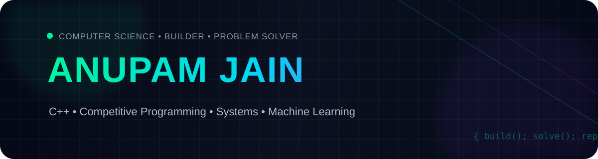

  

  

---

## ⚡ Tech Stack

&nbsp;&nbsp;

&nbsp;&nbsp;

&nbsp;&nbsp;

&nbsp;&nbsp;

&nbsp;&nbsp;

&nbsp;&nbsp;

  

&nbsp;&nbsp;

&nbsp;&nbsp;

&nbsp;&nbsp;

&nbsp;&nbsp;

&nbsp;&nbsp;

&nbsp;&nbsp;

&nbsp;&nbsp;

&nbsp;&nbsp;

---

## 🏆 Holopin Badges

---

## 📊 GitHub Activity

---

## 🏅 Achievements

 

---

## 🚀 Currently Building

<table>
<tr>

<td width="50%" align="center">

### ⚙️ C++ & Systems

Algorithms, performance-oriented C++, data structures and systems programming.

</td>

<td width="50%" align="center">

### 🤖 Machine Learning

Building ML projects and exploring how intelligent systems work under the hood.

</td>

</tr>
</table>

---

## 🔗 Find Me

 

